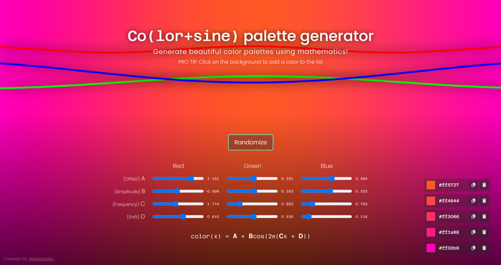

# Color palette generator

<p align="center">
	Generate beautiful color palettes using cosine waves.<br>Tweak the parameters to create a unique and highly customizable palette.
</p>

<p align="center">
	
</p>

Try it out at [https://work.loumadev.eu/color-palette/page.html](https://work.loumadev.eu/color-palette/page.html?p=1.151c0.161c0.484p-0.096c0.183c0.333p1.774c0.892c0.763p0.610c0.535c0.116).

# Installation

1. Clone the repository
   ```bash
   git clone https://github.com/loumadev/color-palette.git
   ```
2. Navigate to page (choose one of the following options)
   * Open file `page.html` in your browser
   * Launch a local web server of your choice in the root directory of the repository and open `http://localhost:8000/page.html` in your browser

# User guide

The generator uses a single cosine wave per channel (3 in total) to generate the color palette.

## Parameters

There are 4 parameters per channel (A, B, C, D; 16 in total) controlling the **Y offset**, **amplitude**, **frequency** and **angular shift** (X offset) of the wave. Each change to the parameters will update the palette as well as the URL containing the parameters, which can be easily shared with others or saved for later use.

## Randomize button

Clicking the randomize button will generate a new palette with random parameters. 

> [!CAUTION]
> When generating a new palette using randomization, the current palette will be lost, so make sure to save it (copy the URL) before clicking the button.

Parameter changes, including randomization are debounced at 500ms, so please, make sure to wait at least half a second between tweaking the parameters and copying the URL or otherwise the URL will be outdated.

## Color list

You can select individual colors from the generated palette by clicking on the background, at location from where you want to select the color. The color will be added to the list. Clicking on the color value in the list will rotate the color format (hex, rgb, hsl) in which the color is displayed. Clicking the save button will copy the color in the format selected to the clipboard. Clicking the remove button will remove the selected color from the list.

# Credits

Concept by [Inigo Quilez](https://iquilezles.org/) from their [TikTok Video](https://www.tiktok.com/@inigoquilez/video/7406635470618168606).

